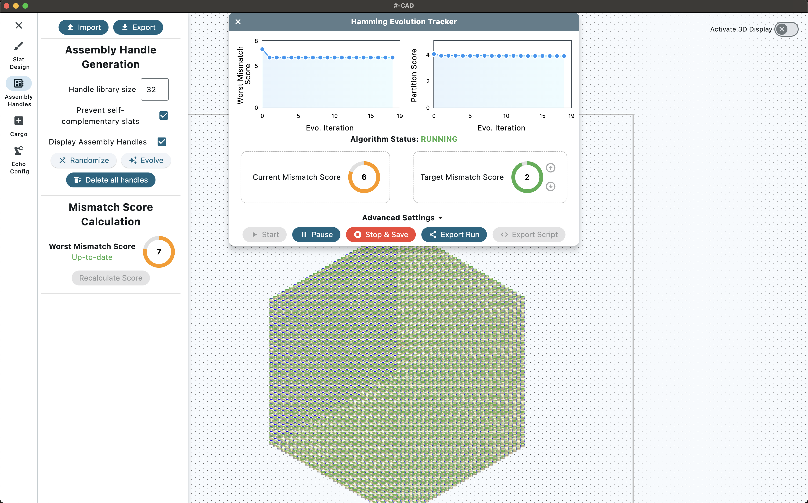

# #-CAD

<p align="center">
  
  
</p>

<p align="center">
  <em>Unified CAD package for megastructure design, assembly and visualization.</em>
</p>

<p align="center">
  
  <a href="https://github.com/mattaq31/Hash-CAD/blob/main/LICENSE">
    
  </a>
  
</p>

## Main CAD Interface
Details TBC.

### Installation
Details TBC.

### Usage Guide
Details TBC.

## Crisscross Python API
\#-CAD was developed alongside a Python API (`crisscross`) that can be used to manipulate megastructures programmatically.  They share the same file format and can be used interchangeably.  The Python interface does provide more flexibility and customizability, at the cost of a steeper learning curve.
### Installation and Requirements
- The Python package was developed using Python 3.11.  Other versions of Python should also work, but it is recommended to use 3.10+.
- To install the python interface, navigate to the root directory and run:

`pip install -e .`

- Next, install the package dependencies using your package manager of choice.  
  - For pip run the following: `pip install -r requirements.txt`
  - For conda run the following: `conda install -c conda-forge --file requirements.txt`
- (Optional), if you would like to be able to generate 3D graphics or 3D blender files for further customization, you need to install additional dependencies:
  - For [PyVista](https://pyvista.org), install the dependencies from `requirements_pyvista.txt` (either pip or conda).
  - For [Blender](https://www.blender.org), simply run `pip install bpy`
- Once the dependencies are installed, you can import the `crisscross` library in any Python script.
### Usage Guide
#### Importing and Editing a Megastructure
- The file format is identical to that of #-CAD i.e. all info is stored within an Excel file.  The file information should be passed to the `Megastructure` class, which is the main container for a design.  To import a megastructure, simply run:
```python
from crisscross.core_functions.megastructures import Megastructure
megastructure = Megastructure.from_file("path/to/excel_sheet.xlsx")
```
Alternatively, a megastructure can be built from a slat bundle, which is a 3D numpy array with format `(x, y, layer)`, where `x` and `y` are the dimensions of the slat bundle and `layer` is the layer number.  Within the array, each slat should have a unique ID per layer, and 32 positions should be occupied per slat.  For example (also available [here](https://github.com/mattaq31/Crisscross-Design/blob/main/crisscross/core_functions/slat_design.py#L10)):
```python
import numpy as np

def generate_standard_square_slats(slat_count=32):
    """
    Generates a base array for a square megastructure design
    :param slat_count: Number of handle positions in each slat
    :return: 3D numpy array with x/y slat positions and a list of the unique slat IDs for each layer
    """
    base_array = np.zeros((slat_count, slat_count, 2))  # width, height, X/Y slat ID

    for i in range(1, slat_count+1):  # slats are 1-indexed and must be connected
        base_array[:, i-1, 1] = i
        base_array[i-1, :, 0] = i

    unique_slats_per_layer = []
    for i in range(base_array.shape[2]):
        slat_ids = np.unique(base_array[:, :, i])
        slat_ids = slat_ids[slat_ids != 0]
        unique_slats_per_layer.append(slat_ids)

    return base_array, unique_slats_per_layer
```
With a slat array defined, this can be passed to the `Megastructure` class as follows:
```python
from crisscross.core_functions.megastructures import Megastructure
from crisscross.core_functions.slat_design import generate_standard_square_slats
slat_array, _ = generate_standard_square_slats()
megastructure = Megastructure(slat_array)
```
The `Megastructure` class will then create a dictionary of `Slat` objects, which can be accessed via the `slats` attribute.  Each `Slat` object contains information about the slat's handles and position.  

If your design file contains assembly, cargo or seed handles, these will all be imported into the megastructure class.  'Placeholder' values are assigned for all handles until you provide sourec plates (see below).

Other customization options are available, which are described in the class` [documentation](https://github.com/mattaq31/Hash-CAD/blob/main/crisscross/core_functions/megastructures.py).

#### Assembly Handle Evolution

Optimizing assembly handles for a design can be taken care of by our customized evolutionary algorithm.  In brief, the algorithm starts from an initial guess and then randomly mutates a set of handles.  The mutated designs are then evaluated through both a hamming and physics-based score, and the best designs are retained for subsequent mutations.  This loop is repeated until some stopping criterion is met.

Evolution is handled by the `EvolveManager` [class](https://github.com/mattaq31/Crisscross-Design/blob/main/crisscross/assembly_handle_optimization/handle_evolution.py), for which documentation is provided in the code itself.  An example of how to use the class is provided [here](https://github.com/mattaq31/Crisscross-Design/blob/main/scripts/assembly_handle_optimization/debugging_evolution.py). The scripting system can be set to be multi-threaded, which should improve performance.  Due to the vectorized implementation used to calculate the hamming distance, the algorithm can significantly slow down with very large arrays (we are looking into this).

A CLI function is also provided to allow evolution to be carried out easily on server clusters.  To use the CLI, simply run:
```bash
handle_evolve -c config_file.toml
```
The config file accepts the same options available in the main `EvolveManager` class.  An example config file is available below (the handle array can be used directly from a saved design file):
```toml
early_hamming_stop = 31
evolution_generations = 20000
evolution_population = 800
process_count = 18
generational_survivors = 5
mutation_rate = 2
slat_length = 32
unique_handle_sequences = 32
split_sequence_handles = true
mutation_type_probabilities = [ 0.425, 0.425, 0.15,]
progress_bar_update_iterations = 10
random_seed = 8
mutation_memory_system = "off"
log_tracking_directory = "/path_to_experiment_directory"
slat_array = "/path/to/design_file.xlsx"
```
#### Assigning Cargo
If assigning cargo programmatically, simply prepare a numpy array of the same size as your slat array (filled with zeros).  Cargo positions should be indicated in the array with a unique integer for each cargo type.  The array can then be assigned to a megastructure as follows:
```python
megastructure.assign_cargo_handles_with_array(cargo_array, cargo_key={1: 'antiBart', 2: 'antiEdna'}, layer='top')
```
The above commands assign cargo to the top layer of a megastructure.  All 1s are assigned the tag `antiBart` and all 2s are assigned the tag `antiEdna`.  These keys are important as they will be used in subsequent steps when extracting sequences from source plates.  As before, full documentation on customization options is available within the `Megastructure` class code.

#### Assigning a Seed
Similarly, a seed can be assigned to a megastructure by passing a numpy array of the same size as the slat array.  The seed positions should be indicated with a specific system - one row of five 1s, a subsequent row of five 2s and so on.  An example of how to generate this array and assign it to a megastructure is provided below:
```python
from crisscross.core_functions.megastructures import Megastructure
from crisscross.core_functions.slat_design import generate_standard_square_slats
import numpy as np

slat_array, _ = generate_standard_square_slats(32)
megastructure = Megastructure(slat_array)

insertion_seed_array = np.arange(16) + 1
insertion_seed_array = np.pad(insertion_seed_array[:, np.newaxis], ((0, 0), (4, 0)), mode='edge')

center_seed_array = np.zeros((32, 32))
center_seed_array[8:24, 13:18] = insertion_seed_array

megastructure.assign_seed_handles(center_seed_array)
```
A more detailed explanation on the above TBC.
#### Plates, Exporting to Echo Liquid Handler and Experiment Helpers
Once a design is completed,  the Megastructure can be exported directly to an [Echo Liquid Handler](https://www.beckman.com/liquid-handlers/echo-acoustic-technology) command sheet.  You will first need to provide a set of plates containing your source H2/H5 handles for each component in your design.  For the crisscross development team, our handle plates are stored [here](https://github.com/mattaq31/Hash-CAD/tree/main/dna_source_plates).  You could use these same plates, or purchase your own sets.  **DETAILS ON PLATE FILE FORMATTING TBC**

Once your plates have been defined and loaded into the crisscross library, you can assign sequences/wells to all handles in your design as follows:
```python
from crisscross.plate_mapping import get_standard_plates, get_cargo_plates

# example plates from the crisscross team
core_plate, crisscross_antihandle_y_plates, crisscross_handle_x_plates, _, _, _, all_8064_seed_plugs = get_standard_plates(handle_library_v2=True)
src_004, src_005, src_007, P3518, P3510,_ = get_cargo_plates()

# assigns all handles in the design to the source plates
megastructure.patch_placeholder_handles(
    [crisscross_handle_x_plates, crisscross_antihandle_y_plates, all_8064_seed_plugs, src_007, P3518, src_004],
    ['Assembly-Handles', 'Assembly-AntiHandles', 'Seed', 'Cargo', 'Cargo', 'Cargo'])

# fills up any remaining handles with core staples (i.e. flush with the slat)
megastructure.patch_control_handles(core_plate)
```

With all handles assigned, the megastructure can be exported to an Echo command sheet as follows:

```python
from crisscross.core_functions.megastructure_composition import convert_slats_into_echo_commands

echo_sheet = convert_slats_into_echo_commands(slat_dict=megastructure.slats,
                             destination_plate_name='plate_name',
                             default_transfer_volume=150,
                             output_folder='path_to_folder',
                             center_only_well_pattern=False,
                             plate_viz_type='barcode',
                             output_filename='echo_commands.csv')
```
For more info and customization options, refer to the documentation [here](https://github.com/mattaq31/Crisscross-Design/blob/main/crisscross/core_functions/megastructure_composition.py#L198).

After mixing your megastructure slat handles, you will next need to anneal and purify each slat before megastructure formation.  Experiment helpers to guide this process can also be generated from the megastructure class data as follows (docs available [here](https://github.com/mattaq31/Hash-CAD/blob/main/crisscross/helper_functions/lab_helper_sheet_generation.py#L462)):
```python
from crisscross.helper_functions.lab_helper_sheet_generation import prepare_all_standard_sheets
prepare_all_standard_sheets(megastructure.slats, 'output_file_name.xlsx',
                            reference_single_handle_volume=150,
                            reference_single_handle_concentration=500,
                            echo_sheet=echo_sheet, # previously generated via the echo command
                            peg_groups_per_layer=4)
```

**More Details on the Experiment Pipeline TBC**
#### Graphics Generation
The Python API also allows you to automatically generate various graphics linked to your megastructure design.  These include 2D schematics for each slat layer, an x-ray view of your design, 2D schematics of your assembly handles, a spinning 3D model video and a blender file which can be configured with an animation showing the expected crisscross assembly process.  An example of how to generate these files for a typical design is provided below:
```python
megastructure.create_standard_graphical_report('output_folder', generate_3d_video=True)
megastructure.create_blender_3D_view('output_folder', camera_spin=False, correct_slat_entrance_direction=True,
                                     colormap='Dark2', cargo_colormap='Set1', seed_color=(1, 0, 0),
                                     include_bottom_light=False)
```
For further info on customization options, check out the related functions in the `Megastructure` class.

Example graphics generated from the hexagram design are provided below (low-resolution versions):
<p align="center">
  
  
  
  
  
</p>

**More complete documentation TBC**
### #-CAD Bundled Python Server
Details TBC.
## Crisscross Assembly Handle Library Generation
Details TBC.
## Development & Support
\#-CAD was developed in the [William Shih Lab](https://www.shih.hms.harvard.edu) at the Dana-Farber Cancer Institute and the Wyss Institute at Harvard University.  The following contributed to the codebase:

- [Matthew Aquilina](https://www.linkedin.com/in/matthewaq/) - Lead developer for the project.
- [Florian Katzmeier](mailto:florian_katzmeier@dfci.harvard.edu) - Developed handle assignment and handle library orthogonal sequence selection algorithms.
- [Stella (Siyuan) Wang](https://www.linkedin.com/in/siyuan-stella-wang-311936247/) - Developed initial megastructure assembly and hamming distance calculation protocols, and implemented various custom megastructure design systems in the final codebase.
- [Corey Becker](https://www.linkedin.com/in/corey-becker-b75656204/) - Developed initial prototype GUI using a combined javascript-python server and laid the foundation for the final #-CAD interface.

Experimental validation of #-CAD was carried out by the entire crisscross origami team, which also included [Huangchen Cui](https://www.linkedin.com/in/huangchen-cui-642b33314/), [Yichen Zhao](https://www.linkedin.com/in/yichen-zhao-83410493/) and [Minke Nijenhuis](https://www.linkedin.com/in/minkenijenhuis/).

For more details of everyone's coding contributions, please check the graphs [here](https://github.com/mattaq31/Hash-CAD/graphs/contributors).

Contributions from the open-source community are welcome!  In particular, we are looking for help with introducing unit tests to both the Python and Flutter packages!

Funding details TBC.

## Literature Citation
Coming soon!
